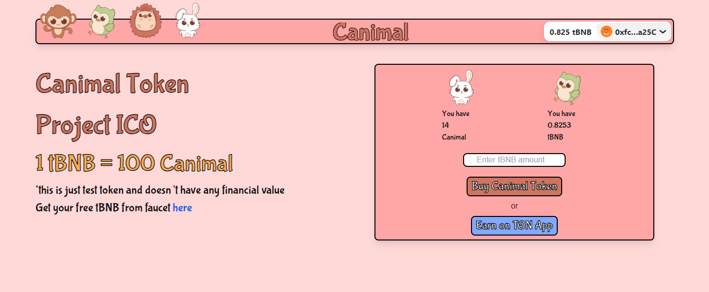

# Canimal Token Project

Canimal Token is an ICO (Initial Coin Offering) project built on the Binance Smart Chain testnet. This project demonstrates the integration of smart contracts with a modern React frontend, allowing users to purchase Canimal tokens using test BNB (tBNB).



## Features

- Connect wallet using RainbowKit
- Display user's tBNB and Canimal token balances
- Purchase Canimal tokens with tBNB
- Real-time transaction status updates
- Responsive design for various screen sizes

## Technologies Used

- Next.js
- React
- Wagmi
- RainbowKit
- Solidity (for smart contracts)
- Binance Smart Chain (testnet)

## Prerequisites

- Node.js (v14 or later)
- Yarn or npm
- MetaMask or any other wallet compatible with Binance Smart Chain testnet

## Installation

1. Clone the repository:
   ```
   git clone https://github.com/rialdytrike/canimal-ico.git
   cd canimal-ico
   ```

2. Install dependencies:
   ```
   yarn install
   # or
   npm install
   ```

3. modify contract address and contract abi  in page.js:
   ```
   CONTRACT_ADDRESS=your_contract_address_here
   CONTRACT_ABI=your_contract_abi
   ```

4. Start the development server:
   ```
   yarn dev
   # or
   npm run dev
   ```

5. Open [http://localhost:3000](http://localhost:3000) in your browser to see the application.

## Usage

1. Connect your wallet using the "Connect Wallet" button.
2. Ensure you have some test BNB (tBNB) in your wallet. You can get free tBNB from the [BSC Testnet Faucet](https://testnet.binance.org/faucet-smart).
3. Enter the amount of tBNB you want to spend in the input field.
4. Click the "Buy Canimal Token" button to purchase tokens.
5. Confirm the transaction in your wallet.
6. Wait for the transaction to be processed. The UI will update to show the transaction status.
7. Once the transaction is successful, your Canimal token balance will be updated.

## Smart Contract

The Canimal Token smart contract is deployed on the Binance Smart Chain testnet. The contract address is:

```
0xC86CAD54Ba2F3F66d9Ee8256ecFE5a63d6eAeea7
```

You can view the contract on [BscScan Testnet](https://testnet.bscscan.com/address/your_contract_address_here).

## Contributing

Contributions are welcome! Please feel free to submit a Pull Request.

## License

This project is licensed under the MIT License - see the [LICENSE](LICENSE) file for details.

## Acknowledgments

- [Wagmi](https://wagmi.sh/) for React Hooks for Ethereum
- [RainbowKit](https://www.rainbowkit.com/) for wallet connection
- [OpenZeppelin](https://openzeppelin.com/) for secure smart contract development

## Contact

If you have any questions, feel free to reach out to [Your Name] at [your.email@example.com].

---

Don't forget to star ⭐ this repo if you find it useful!
